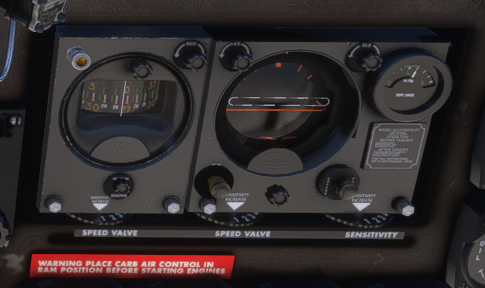
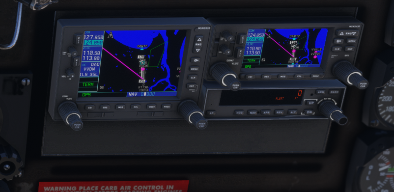

title: Douglas DC-3
modified: November 18, 2025
slug: fse/planes/dc3
status: hidden
at: FSEconomy
at_link: fse/
at_2: Planes
at_2_link: fse/planes/
image: images/fse/dc3-dash-2026-02-24-21-17-12.PNG

## In FSEconomy

The DC-3 is a workhorse of another era. In FSE, it carries 19 passengers, which
can make it challenging to fill without some planning. That said, it seems to
be cheap enough to operate that it turns decent profit for me even half full.
As a prop plane, it's not particularly fast, but its not slow for what it is.
Once off the ground, it climbs well.

Can be had starting at ~~(in September 2025) v$800,000~~ (in November
2025) v$900,000, although all the currently for sale models (as of March 2025)
have hundreds of hours on them.

## In Microsoft Flight Simulator

Has been included in MSFS 2024 as part of the base game; fuel tanks match the
FSE layout.

The instrument cluster has an older style for many of the instruments, and they
aren't arranged in the classic "six pack". Another part I struggle with is that
many of the instruments are low on the dash, so it's hard to monitor them and
what's on the front window at the same time.

Personally, I also struggle with keeping it straight on takeoff, where it wants
to veer to the left shortly after it starts moving down the runway, and also on
landing, where I often end up with it sideways off the side of the runway.

I also recently (February 2026) discovered yellow knobs on the pilot's side of
the center console labeled "supercharger"; these seem to make the plane got
quite a bit faster, although no doubt at the cost of fuel usage.

### Classic vs Retrofit

In MSFS 2024, there seems to be two "versions" of the DC-3: *Classic* and
*Retrofit*. Which version you fly seems to be tied to which livery you pick.
The main difference (near as I've been able to tell) is the model of autopilot.

The *classic* autopilot is the "Sperry Gyro Pilot", which can control roll and
pitch, but in particular has no "hold altitude" function to allow it to fly up
(or down) to an altitude and then level out there. It also lacks any ability to
tie in to a GPS unit (*that shouldn't be surprising, given it's age, right?*).

    
    <caption>Sprerry Gyro Pilot</caption>

The *retrofit* version includes a basic Garmin GPS (430 + 530) plus a
Bendix/King KAP 140, the same model as used in [WBSim's Cessna
152]({filename}c182.md#download) or as a download for the  [Cessna
185]({filename}c185.md), but all three of them are slightly different
implementations, and so work/respond slightly different. In particular, on the
DC-3, I have yet to figure out how to set the Autopilot's heading.

    
    <caption>Retrofit Autopilot: Bendix/King KAP 140</caption>

## FSE Planes for Sale/Lease

- [Titan](https://fseconomy.net/forum/mp-aircraft/147800-titan-air-leasing-super-competitive-prices)
  is offering one for lease at v$20,000/month (v$25,000 the first month)
- [Anderssnorway](https://www.fseconomy.net/forum/general-market-place-discussion/149797-dc3-for-lease)
  is offering his for lease at v$30,000/month
